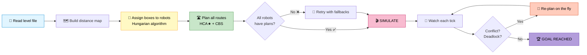
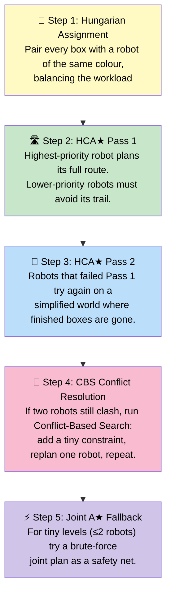
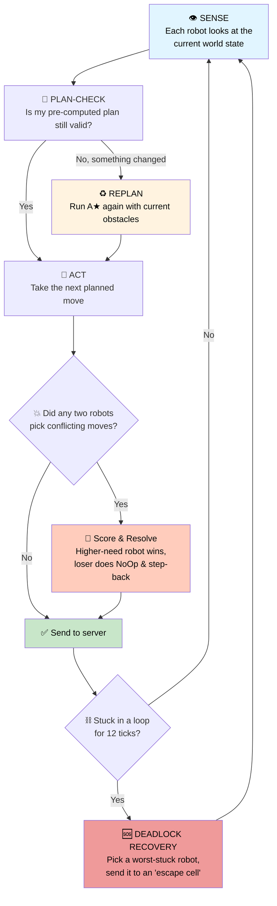
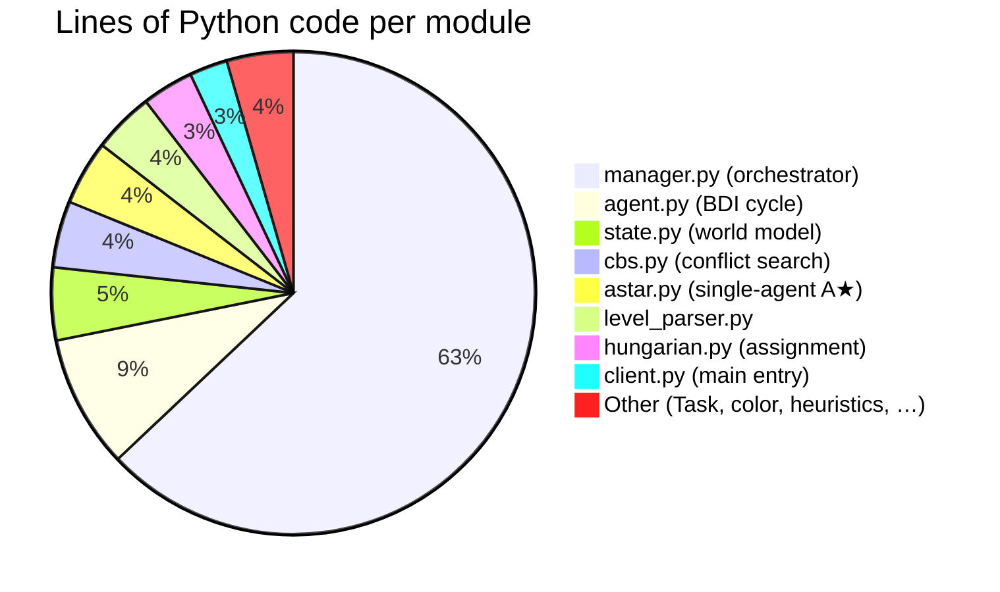

<div align="center">

# 🏥 Multi-Agent Hospital Project

### *Many robots. One hospital. Zero collisions.*

A multi-agent AI planner that coordinates a team of colour-coded robots to move boxes around a hospital floor — without bumping into walls, into each other, or into chaos.


</div>

---

## 🤔 What is this, in one sentence?

> **Imagine a hospital where eight colour-coded delivery robots all need to push boxes to specific rooms at the same time. This program is the *brain* that tells each robot what to do, every single second, so the whole team finishes the job as fast as possible — without any traffic jams.**

---

## 🎬 The Story 

### The Problem

A hospital floor is laid out like a grid. On it you have:

| Emoji | What it is | Real-world analogy |
|:---:|---|---|
| 🤖 | **Agents** (the robots) | Delivery nurses, each with a uniform colour |
| 📦 | **Boxes** | Carts of medicine / equipment to be moved |
| 🎯 | **Goals** | The room each cart needs to end up in |
| 🧱 | **Walls** | Walls, corridors, doors — fixed obstacles |
| 🌈 | **Colours** | A robot can only push a box of *its own* colour |

Every robot can do one of four things each second:
**Move ⬅️➡️⬆️⬇️**, **Push** a box, **Pull** a box, or **Wait**.

### The Challenge

* 🚫 Two robots cannot stand on the same tile.
* 🚫 A robot cannot push a box of the wrong colour.
* 🚫 Corridors are narrow — robots have to take turns.
* 🚫 Sometimes a robot's path is blocked by *another team's* box, so it must politely ask that team to move it.
* ⏱️ Whole thing must finish in **3 minutes** and **20,000 moves**.

### What this project does

It reads the hospital map, figures out **who should do what**, plans every robot's route, watches the simulation tick by tick, and **re-plans on the fly** when robots get in each other's way.

---

## 🗺️ A Picture is Worth a Thousand Words

Here is the actual `WardRush.lvl` map this project solves — eight robots, eight different colours, sixteen boxes to deliver:

<table>
<tr><th align="center">🏁 START STATE</th><th align="center">🏆 GOAL STATE</th></tr>
<tr><td>

```
+++++++++++++++++++++++++++++++++++++++
+                                     +
+                                     +
+ +++++++++++++++++++B+++++++++A++++++
+   4   D       +   + +               +
+               + +++ +               +
+               + +   +               +
+               +3+++ +               +
+                   + +               +
+                   + ++              +
+      G            +  +              +
+                   + ++              +
+F     567         H+ +               +
++++++++++++++++++++C+++++++++++++++++
+                   1E2               +
+                                     +
+                                     +
+     0                               +
+++++++++++++++++++++++++++++++++++++++
```

</td><td>

```
+++++++++++++++++++++++++++++++++++++++
+                                     +
+                                    D+
+ +++++++++++++++++++ +++++++++E++++++
+               +  B+ +               A
+               + +++ +               +
+               + +   +               +
+               + +++ +               +
+                   + +3              +
+                   + ++              +
+G                  +  +              +
+F      6          H+ ++              +
+      5 7          + +2              +
+++++++++++++++++++++ +++++++++++++++++
+01                                   +
+                                     +
+                                     +
+                                     +
+++++++++++++++++++++++++++++++++++++++
```

</td></tr>
</table>

**Numbers `0–7`** are the 8 robots. **Letters `A–H`** are the boxes (each pair has a matching colour). Solving this takes the planner **267 carefully coordinated actions in ~4 seconds** of wall-clock thinking.

---

## 🧠 How the Brain Works

Think of the program as a **chess engine for warehouses**. It plays in two phases:



### Phase 1 — Setup (think first, move later)



### Phase 2 — Main Loop (every single tick)



---

## 🧮 The Algorithms, Explained Without Math

| Algorithm | What it does (in one line) | Real-world analogy |
|---|---|---|
| **Hungarian Algorithm** | Pairs every box with a robot in the cheapest way possible | A taxi dispatcher matching cabs to riders so the total driving time is minimum |
| **A★ (A-star)** | Finds the shortest path for ONE robot through walls | Google Maps for a single car |
| **HCA★ (Hierarchical Cooperative A★)** | Robots plan one at a time; later ones see earlier ones' trails as "no-go zones in time" | A queue at a single-lane bridge — first car books a slot, second works around it |
| **CBS (Conflict-Based Search)** | When two robots' paths cross, gently nudge one of them and re-plan | Two pedestrians sidestepping to let each other pass |
| **Joint A★** | Plan all robots together as a single super-robot (used only when there are ≤2 robots) | Synchronized swimming — every move choreographed in advance |
| **Implicit Negotiation** | If robot A's path is blocked by *team B*'s box, A re-tasks B to clear it | "Hey, could you move your cart? Thanks!" — between robots |
| **Anytime CBS** | Keep enlarging the search budget under a wall-clock deadline, return the first plan that works | Asking "give me your best answer in 5 seconds" instead of "give me the perfect answer eventually" |

> 🎓 **Cool research idea baked in:** Every cross-team task swap is logged to `negotiations.json` as a typed event. If the same swap chain repeats too often, the program detects the **oscillation** and refuses further swaps — a principled fix to negotiation cycles, replacing the previous "give up after 5 tries" hack.

---

## 📊 Project Stats



| 📈 Metric | Value |
|---|---|
| Total Python lines | **~6,100** |
| Algorithms implemented | **7** core + several fallbacks |
| Solved competition levels | **22** (see `SOLVED_LEVELS.txt`) |
| Hardest solved level | `WardRush` — 8 robots, 16 boxes, 267 actions in 4 s |
| Time budget per level | 3 minutes, 20 000 actions |

---

## 📁 What's in the box?

```
ProgrammingProject-MAS-ketan/
│
├── 📜 README.md                  ← you are here
├── 📜 ARCHITECTURE.txt           full architecture write-up
├── 📜 MANAGER_FLOW.md            step-by-step reference for the orchestrator
├── 📜 CREATION.md                design journal (the "why")
├── 📜 DESIGN.md                  high-level design skeleton
├── 📜 REPORT.md                  course exercise answers
├── 📜 SOLVED_LEVELS.txt          list of competition levels we solve
├── 📜 negotiations.json          log of all cross-agent task swaps (auto-generated)
│
├── 🏛️ server.jar                 official DTU MAS hospital simulator
├── 🚀 test.sh                    one-liner runner script
│
├── 📂 searchclient_python/
│   └── 📂 searchclient/          ← the brain
│       ├── 🐍 client.py          entry point + 19,500-step main loop
│       ├── 🐍 manager.py         orchestrator (HCA★, CBS, BDI, deadlock recovery)
│       ├── 🐍 agent.py           single-robot Beliefs-Desires-Intentions cycle
│       ├── 🐍 level_parser.py    .lvl file → world state
│       ├── 🐍 state.py           joint state, conflict & goal checks
│       ├── 🐍 action.py          4 Moves + 12 Pushes + 12 Pulls + NoOp
│       ├── 🐍 color.py           the 10 colours
│       ├── 🐍 heuristics.py      distance maps (BFS from every goal cell)
│       ├── 🐍 Task.py            unified Task dataclass
│       ├── 🐍 task_swap.py       typed negotiation event
│       ├── 🐍 memory.py          RSS memory tracker (psutil)
│       └── 📂 planner/
│           ├── 🐍 astar.py       space-time A★
│           ├── 🐍 cbs.py         Conflict-Based Search + anytime variant
│           └── 🐍 hungarian.py   Kuhn–Munkres O(n³) assignment
│
├── 📂 levels/                    ~100 levels — official, MAPF, simple, challenge
├── 📂 complevels/                72 previous-year competition levels
├── 📂 custom/                    bespoke levels we wrote ourselves
├── 📂 previous_years_levels/     archive
├── 📂 docs/                      analysis notes (coverage, pros/cons)
│
├── 📕 hospital_domain.pdf        formal definition of the domain
├── 📕 prog_proj_assignment.pdf   the assignment brief
└── 📕 debugging.pdf              debugging tips from the course
```

---

## 🚀 Try It Yourself

### Prerequisites
* ☕ Java 8+
* 🐍 Python 3.10+
* 📦 `pip install psutil`

### Run a level

```bash
# generic command
PYTHONPATH=searchclient_python java -jar server.jar \
  -l levels/WardRush.lvl \
  -c "python3 -m searchclient.client" \
  -s 300 -g

# or use the helper script
./test.sh levels/WardRush.lvl
```

Flags worth knowing:

| Flag | Meaning |
|---|---|
| `-l <file>` | level to load |
| `-c "<cmd>"` | command that launches our client |
| `-s <ms>` | min milliseconds between frames (animation speed) |
| `-g` | show the graphical replay window |
| `-t <s>` | timeout in seconds (default 180) |

### Recommended starter levels
* 🟢 `levels/MAsimple1.lvl` — 2 robots, easy
* 🟡 `levels/MAExample.lvl` — classic textbook level
* 🟠 `levels/MAPF02.lvl` — multi-agent path finding
* 🔴 `WardRush.lvl` — the showcase, 8 robots

---


---

## 🏆 Things We're Proud Of

1. **CBS-first pipeline** — replaced the old "HCA★ fast-path first" with a CBS-first strategy. On `WardRush`, total solving time dropped from **21.6 s → 4.0 s** with no loss in plan quality.
2. **A real Hungarian algorithm** — replaced a greedy box→goal matcher with a proper O(n³) Kuhn–Munkres implementation; the function name finally matches what it does.
3. **Anytime CBS** — wraps CBS with a progressively expanding node cap under a wall-clock deadline, directly addressing the 3-minute competition budget.
4. **Negotiation log + cycle detection** — every cross-team task swap is a typed `TaskSwap` record; oscillating swap chains are detected and refused.
5. **Per-level deterministic behaviour** — no randomness inside the main loop, so re-runs reproduce exactly.

---

## 📜 License

Course project — for academic use. Server JAR and PDFs belong to the DTU 02285 course staff.

---

<div align="center">

### Made with 🧠, ☕ and a *lot* of `print(file=sys.stderr)`

*If the robots bump into each other anyway, that's a feature, not a bug.* 🤖💥🤖

</div>
